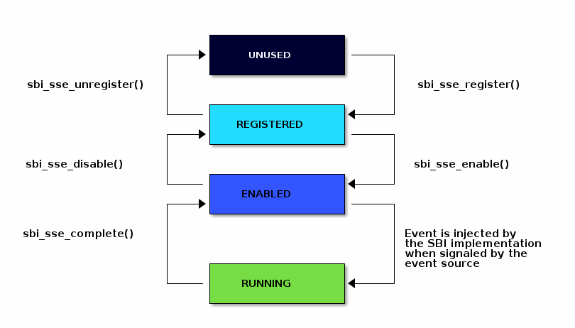

== SBI Supervisor Software Events Extension (EID #0x535345 "SSE")

The SBI Supervisor Software Events (SSE) extension provides a
mechanism to inject software events from an SBI implementation
to supervisor software such that it preempts all other traps and
interrupts.

The software events can be of two types: local or global. A
local software event is local to a HART and can be handled
only on that HART whereas a global software event is a system
event and can be handled by any HART.

=== Software Event Identification

Each software event is identified by a unique 32-bit unsigned
integer called `event_id` which is encoded as shown in
<<table_sse_event_ids>> below.

[#table_sse_event_ids]
.SSE Event Identification
[cols="2,3", width=90%, align="center", options="header"]
|===
| Software Event ID            | Description
| 0x00000000                   | Local RAS event
| 0x00000001                   | Local PMU event
| 0x00000002                   | Local async page fault event
| 0x00000003 - 0x3fffffff      | Reserved for future use
| 0x40000000 - 0x7ffffffe      | Local platform specific event
| 0x7fffffff                   | Local debug event
| 0x80000000                   | Global RAS event
| 0x80000001 - 0xbfffffff      | Reserved for future use
| 0xc0000000 - 0xfffffffe      | Global platform specific event
| 0xffffffff                   | Global debug event
|===

=== Software Event States

At any point in time, a software event can be in one of the
following states:

. **UNUSED**     - Software event is not used by supervisor software
. **REGISTERED** - Supervisor software has provided an event
                    handler for the software event but it is
                    not ready to handle the events.
. **ENABLED**    - Supervisor software is ready to handle the
                    software event.
. **PENDING**    - Software event is pending and not yet delivered
                    to the supervisor software.
. **RUNNING**    - Supervisor software has taken the software
                    event and is busy handling it.

The below diagram shows the state transitions of a software
event.

[#figure_sbi_sse_state_machine]
.SBI SSE State Machine

A **global** software event **MUST** be registered and enabled only once by
any HART. By default, a global software event will be routed to any HART
but supervisor software can select a specific HART to handle this event.
The state of a global software event **MUST** be common to all HARTs.

A **local** software event **MUST** be registered and enabled by all HARTs
who want to handle the event. The state of a local software event **MUST**
be tracked separately for each HART.

=== Software Event Priority

Each software event has an associated event priority (also
referred as `event_priority`) which can be used by an SBI
implementation to select a software event for injection
when multiple software events are pending on the same HART.

The priority of a software event is a 32-bit unsigned
integer where lower value means higher priority. By default,
all software events have event priority as zero.

If two or more event have same priority on a given hart
then SBI implementation must use `event_id` to break the tie
where lower `event_id` has higher priority.

A higher priority event, unless disabled by supervisor software,
**always** preempts a lower priority event on the same HART.
Once the higher priority event is marked as completed, the
previous handler will be resumed.

NOTE: If a pending or running event is signalled by the event source again,
the event will become pending only after the current event completes
provided that supervisor software doesn't disable the event on completion.

=== Software Event Attributes

A software event can have various attributes associated to it.
A software event attribute is a unique 32-bit unsigned integer
called `attr_id`. An attribute can have a Read-Only or Read-Write
access permissions. The supervisor software can query these event
attributes and change the attributes that have Read-Write access
permissions.
The <<table_sse_event_attributes>> below provides a list
event attributes.

[#table_sse_event_attributes]
.SSE Event Attributes
[cols="3,3,5,5", width=90%, align="center", options="header"]
|===
| Attribute ID (attr_id)
| Read-Only
| Description
| Possible values

| 0x00000000
| Yes
| Software event state
| 0: UNUSED +
  1: REGISTERED +
  2: ENABLED +
  3: PENDING +
  4: RUNNING

| 0x00000001
| No
| Software event priority
| 32-bit unsigned integer

| 0x00000002
| Yes
| Event injection by the supervisor software using `sbi_sse_inject` call.
| 0: Not allowed +
  1: Allowed

| 0x00000003
|  No  (global) +
   Yes (local)
| The HART id of HART that should be preferred to handle the global software event
| unsigned long integer

| 0x00000004
| Yes
| Raw Pending Status
| This is set when the event source signals the event. When the event is injected, it is cleared. +
  0: Not Pending
  1: Pending

| > 0x00000004
| ---
| Reserved for future use
| ---
|===

=== Software Event Handler
To handle a software event, the supervisor software MUST register
an event handler and enable it. Each event handler registered by
the supervisor software consists of a handler context (also referred to as `handler_context`).

The `handler_context` contains the following register states:

. **Entry State** - It contains the supervisor register state when handling the software event
  injected by SBI implementation. It is referred as `entry_state`. This register state
  must be initialized by the supervisor software before registering the handler. The handler's
  entry point is at the offset 0 of the `entry_state` as mentioned in
  <<table_sse_entry_state_reg_offset>>
. **Interrupted State** - It contains interrupted register state and is referred as
  `interrupted_state`. The interrupted execution mode is saved at the end of the
  `interrupted_state`.

The `handler_context`  must be contiguous in both virtual and physical address
space. The physical address of the `handler_context` is represented by
`handler_context_phys`.

NOTE: It is advisable to use different context for different events. Since a higher
priority event can preempt the lower priority event, if same context is used then the
interrupted state will be overwritten with register values of the higher priority event.
This will make resuming to the previous handler impossible.

[#table_sse_entry_state_reg_offset]
[cols="5,3", width=90%, align="center", options="header"]
.SSE Register offsets in entry state
|===
| Register Offsets in Entry State    | Data
| `entry_state` + 0 * `(XLEN / 8)`    | Entry program counter +
                                        Must be 2-byte aligned virtual address.
| `entry_state` + 1 * `(XLEN / 8)`     | X1
| `entry_state` + 2 * `(XLEN / 8)`     | X2
| `entry_state` + 3 * `(XLEN / 8)`     | X3
| `entry_state` + 4 * `(XLEN / 8)`     | X4
| `entry_state` + 5 * `(XLEN / 8)`     | X5
| `entry_state` + 6 * `(XLEN / 8)`     | X6
| `entry_state` + 7 * `(XLEN / 8)`     | X7
| `entry_state` + 8 * `(XLEN / 8)`     | X8
| `entry_state` + 9 * `(XLEN / 8)`     | X9
| `entry_state` + 10 * `(XLEN / 8)`    | X10
| `entry_state` + 11 * `(XLEN / 8)`    | X11
| `entry_state` + 12 * `(XLEN / 8)`    | X12
| `entry_state` + 13 * `(XLEN / 8)`    | X13
| `entry_state` + 14 * `(XLEN / 8)`    | X14
| `entry_state` + 15 * `(XLEN / 8)`    | X15
| `entry_state` + 16 * `(XLEN / 8)`    | X16
| `entry_state` + 17 * `(XLEN / 8)`    | X17
| `entry_state` + 18 * `(XLEN / 8)`    | X18
| `entry_state` + 19 * `(XLEN / 8)`    | X19
| `entry_state` + 20 * `(XLEN / 8)`    | X20
| `entry_state` + 21 * `(XLEN / 8)`    | X21
| `entry_state` + 22 * `(XLEN / 8)`    | X22
| `entry_state` + 23 * `(XLEN / 8)`    | X23
| `entry_state` + 24 * `(XLEN / 8)`    | X24
| `entry_state` + 25 * `(XLEN / 8)`    | X25
| `entry_state` + 26 * `(XLEN / 8)`    | X26
| `entry_state` + 27 * `(XLEN / 8)`    | X27
| `entry_state` + 28 * `(XLEN / 8)`    | X28
| `entry_state` + 29 * `(XLEN / 8)`    | X29
| `entry_state` + 30 * `(XLEN / 8)`    | X30
| `entry_state` + 31 * `(XLEN / 8)`    | X31
|===

[#table_sse_interrupted_state_reg_offset]
[cols="5,3", width=90%, align="center", options="header"]
.SSE Register offsets in interrupted state
|===
| Register Offsets in Interrupted State      | Data
| `interrupted_state` + 0 * `(XLEN / 8)`     | Interrupted program counter
| `interrupted_state` + 1 * `(XLEN / 8)`     | Saved copy of X1
| `interrupted_state` + 2 * `(XLEN / 8)`     | Saved copy of X2
| `interrupted_state` + 3 * `(XLEN / 8)`     | Saved copy of X3
| `interrupted_state` + 4 * `(XLEN / 8)`     | Saved copy of X4
| `interrupted_state` + 5 * `(XLEN / 8)`     | Saved copy of X5
| `interrupted_state` + 6 * `(XLEN / 8)`     | Saved copy of X6
| `interrupted_state` + 7 * `(XLEN / 8)`     | Saved copy of X7
| `interrupted_state` + 8 * `(XLEN / 8)`     | Saved copy of X8
| `interrupted_state` + 9 * `(XLEN / 8)`     | Saved copy of X9
| `interrupted_state` + 10 * `(XLEN / 8)`    | Saved copy of X10
| `interrupted_state` + 11 * `(XLEN / 8)`    | Saved copy of X11
| `interrupted_state` + 12 * `(XLEN / 8)`    | Saved copy of X12
| `interrupted_state` + 13 * `(XLEN / 8)`    | Saved copy of X13
| `interrupted_state` + 14 * `(XLEN / 8)`    | Saved copy of X14
| `interrupted_state` + 15 * `(XLEN / 8)`    | Saved copy of X15
| `interrupted_state` + 16 * `(XLEN / 8)`    | Saved copy of X16
| `interrupted_state` + 17 * `(XLEN / 8)`    | Saved copy of X17
| `interrupted_state` + 18 * `(XLEN / 8)`    | Saved copy of X18
| `interrupted_state` + 19 * `(XLEN / 8)`    | Saved copy of X19
| `interrupted_state` + 20 * `(XLEN / 8)`    | Saved copy of X20
| `interrupted_state` + 21 * `(XLEN / 8)`    | Saved copy of X21
| `interrupted_state` + 22 * `(XLEN / 8)`    | Saved copy of X22
| `interrupted_state` + 23 * `(XLEN / 8)`    | Saved copy of X23
| `interrupted_state` + 24 * `(XLEN / 8)`    | Saved copy of X24
| `interrupted_state` + 25 * `(XLEN / 8)`    | Saved copy of X25
| `interrupted_state` + 26 * `(XLEN / 8)`    | Saved copy of X26
| `interrupted_state` + 27 * `(XLEN / 8)`    | Saved copy of X27
| `interrupted_state` + 28 * `(XLEN / 8)`    | Saved copy of X28
| `interrupted_state` + 29 * `(XLEN / 8)`    | Saved copy of X29
| `interrupted_state` + 30 * `(XLEN / 8)`    | Saved copy of X30
| `interrupted_state` + 31 * `(XLEN / 8)`    | Saved copy of X31
| `interrupted_state` + 32 * `(XLEN / 8)`    | Interrupted Execution mode +
                                              **bit [0]** = Privilege mode which
                                              was interrupted +
                                              (1 = S-mode, 0 = U-mode) +
                                              **bit [1]** = Virtualization state
                                              which was interrupted +
                                              (1 = ON, 0 = OFF) +
                                              **bit [2]** = Saved copy of
                                              sstatus.SPIE +
                                              **bit [XLEN-1:3]** = Reserved for
                                              future use
|===

=== Software Event Injection

To inject a software event on a HART, the SBI implementation must
do the following:

. Copy X1 to X31 registers into the `interrupted_state` in `handler_context`
  from the offsets mentioned in <<table_sse_interrupted_state_reg_offset>>.
. Load X1 to X31 registers from `entry_state` in `handler_context` from the
  offsets mentioned in <<table_sse_entry_state_reg_offset>>.
. Save the interrupted mode at offset `interrupted_state` + 32 * `(XLEN / 8)`
  in `handler_context` as shown in <<table_sse_interrupted_state_reg_offset>>.
. Update registers as follows:
   .. Set sstatus.SPIE = sstatus.SIE
   .. Set sstatus.SIE = 0
. Resume execution with:
   .. Program counter = value at `entry_state` + 0 * `(XLEN / 8)`
   .. Privilege mode = S-mode
   .. Virtualization state = OFF

=== Software Event Completion

After handling the software event on a HART, the supervisor
software must notify the SBI implementation about completion
of event handling using using `sbi_sse_complete` call. The
SBI implementation must do the following to complete event
handling and resume interrupted state:

. Restore X1 to X31 registers from the `interrupted_state` of
  `handler_context` from the offsets mentioned in
  <<table_sse_interrupted_state_reg_offset>>.
. Update supervisor CSRs as follows:
   .. Set sstatus.SIE = sstatus.SPIE
   .. Set sstatus.SPIE = bit[2] of the value at
                        `interrupted_state` + 32 * `(XLEN / 8)`
. Resume execution with:
   * Virtualization state =  bit[1] of the value at
                            `interrupted_state` + 32 * `(XLEN / 8)`
   * Privilege mode = bit[0] of the value at
                     `interrupted_state` + 32 * `(XLEN / 8)`
   * Program counter = value at `interrupted_state` + 0 * `(XLEN / 8)`

If the supervisor software wishes to resume from a different location,
it can update the `interrupted_state` fields accordingly.
 
=== Function: Get a software event attribute (FID #0)

[source, C]
----
struct sbiret sbi_sse_get_attr(uint32_t event_id,
                               uint32_t attr_id)
----

Get an event attribute value of software event. The `event_id`
parameter specifies the software event whereas `attr_id` parameter
specifies the event attribute.

Upon success the event attribute value is returned in `sbiret.value`.
In case of an error, the possible error codes are shown in the
<<table_sse_get_attr_errors>> below:

[#table_sse_get_attr_errors]
.SSE Event Attribute Read Errors
[cols="2,3", width=90%, align="center", options="header"]
|===
| Error code            | Description
| SBI_SUCCESS           | Attribute of given event returned successfully.
| SBI_ERR_INVALID_PARAM | `event_id` or `attr_id` or both are invalid.
|===

=== Function: Set a software event attribute (FID #1)

[source, C]
----
struct sbiret sbi_sse_set_attr(uint32_t event_id,
                               uint32_t attr_id,
                               unsigned long value)
----

Set an event attribute value of software event. The `event_id`
parameter specifies the software event whereas `attr_id` parameter
specifies the event attribute. The new event attribute value is
specified by `value` parameter.

Any error is returned in `sbiret.error`. The possible return values
are listed in <<table_sse_set_attr_errors>> below:

[#table_sse_set_attr_errors]
.SSE Event Attribute Write Errors
[cols="2,3", width=90%, align="center", options="header"]
|===
| Error code            | Description
| SBI_SUCCESS           | Attribute value set successfully.
| SBI_ERR_INVALID_PARAM | `event_id` or `attr_id` or both are invalid
| SBI_ERR_BAD_RANGE     | `value` does not match the possible values
	                   defined in <<table_sse_event_attributes>>.
|===

=== Function: Register a software event (FID #2)

[source, C]
----
struct sbiret sbi_sse_register(uint32_t event_id,
                               unsigned long handler_context_phys_hi,
                               unsigned long handler_context_phys_lo)
----

Register a handler for the software event. The `event_id` parameter
specifies the event ID for which handler is being registered. The
parameters `handler_context_phys_hi` and `handler_context_phys_lo`
contain the upper and lower XLEN bits, respectively, of the handler's
context. The `handler_context_phys_lo` parameter must be `(XLEN / 8)`
byte aligned.

On successful registration, the event state moves from `UNUSED` to
`REGISTERED`. In case of an error, possible error codes are listed in
<<table_sse_register_errors>> below:

[#table_sse_register_errors]
.SSE Event Register Errors
[cols="2,3", width=90%, align="center", options="header"]
|===
| Error code              | Description
| SBI_SUCCESS             | Event handler is registered successfully.
| SBI_ERR_INVALID_STATE   | The event is not in `UNUSED` state.
| SBI_ERR_INVALID_PARAM   | `event_id` is invalid or other parameters not satisfy
	                    requirements defined in <<_software_event_handler>>.
| SBI_ERR_INVALID_ADDRESS | The memory pointed by `handler_context_phys_lo`,
			    `handler_context_phys_hi`, parameters does not satisfy
			    the requirements described
	                    in <<_shared_memory_physical_address_range_parameter>> or
			    The `handler_context_phys_lo` parameter is not `(XLEN / 8)`
	                    byte aligned.
|===

=== Function: Unregister a software event (FID #3)

[source, C]
----
struct sbiret sbi_sse_unregister(uint32_t event_id)
----

Unregister the handler for given `event_id`. The event MUST be in `REGISTERED`
state before it can be unregistered.

On successful unregistration, the event is moved to `UNREGISTERED` state.
In case of an error, possible error codes are listed in
<<table_sse_unregister_errors>> below:

[#table_sse_unregister_errors]
.SSE Event Unregister Errors
[cols="2,3", width=90%, align="center", options="header"]
|===
| Error code              | Description
| SBI_SUCCESS             | Event handler is unregistered successfully.
| SBI_ERR_INVALID_STATE   | Event is not in `REGISTERED` state.
| SBI_ERR_INVALID_PARAM   | `event_id` is invalid.
|===

=== Function: Enable a software event (FID #4)

[source, C]
----
struct sbiret sbi_sse_enable(uint32_t event_id)
----

Enable the software event specified by the `event_id` parameter.
For local events, the event is enabled only for the calling HART.
For global events, the event is enabled for all the harts of
supervisor software.

The event MUST be in `REGISTERED` state otherwise this function will fail.

On success, the event is moved to `ENABLED` state and SBI implementation
can inject the event when it occurs. In case of an error, possible
error codes are listed in <<table_sse_enable_errors>> below:

[#table_sse_enable_errors]
.SSE Event Enable Errors
[cols="2,3", width=90%, align="center", options="header"]
|===
| Error code              | Description
| SBI_SUCCESS             | Event is successfully enabled.
| SBI_ERR_INVALID_PARAM   | `event_id` is not valid.
| SBI_ERR_INVALID_STATE   | The event is not in `REGISTERED` state.
|===

=== Function: Disable a software event (FID #5)

[source, C]
----
struct sbiret sbi_sse_disable(uint32_t event_id)
----

Disable the software event specified by the `event_id` parameter.
For local events, the event is disabled only for the calling HART.
For global events, the event is disabled for all the harts of
supervisor software. The event must be in `ENABLED` state.

On success, the event is moved to `REGISTERED` state. In case of
an error, possible error codes are listed in
<<table_sse_disable_errors>>.

[#table_sse_disable_errors]
.SSE Event Disable Errors
[cols="2,3", width=90%, align="center", options="header"]
|===
| Error code              | Description
| SBI_SUCCESS             | Event is successfully disabled.
| SBI_ERR_INVALID_PARAM   | `event_id` is not valid.
| SBI_ERR_INVALID_STATE   | Event is not in `ENABLED` state.
|===

=== Function: Complete software event handling (FID #6)

[source, C]
----
struct sbiret sbi_sse_complete(uint32_t event_id,
                               uint32_t status,
                               uint32_t flags)
----

Complete the supervisor event handling for the event. The event
must be in `RUNNING` state.

If supervisor software could not handle the event, it must
set the `status` parameter to `SBI_SSE_HANDLER_FAILED`. On success,
it must set the `status` parameter to `SBI_SSE_HANDLER_SUCCESS`.
Other possible status codes are listed in <<table_sse_complete_status>>.
Any other value of `status` field is ignored.

The `flags` parameter represents additional information from supervisor
to the SBI implementation and the <<table_sse_complete_flags>> lists
the bit-encoding for it.

[#table_sse_complete_status]
.SSE Event Complete Status Values
[cols="3,2,3", width=90%, align="center", options="header"]
|===
| Value         | Enum Name                | Description
| 0x00000000    | SBI_SSE_HANDLER_SUCCESS  | Supervisor successfully handled the event.
| 0x00000001    | SBI_SSE_HANDLER_FAILED   | Supervisor failed to handle the event.
| > 0x00000001  | -                        | Reserved
|===

[#table_sse_complete_flags]
.SSE Event Complete Flags Values
[cols="3,2,3", width=90%, align="center", options="header"]
|===
| Flag Name                   | Bits       | Description
| SBI_SSE_EVENT_DISABLE       | 0:0        | Disable the event.
| *RESERVED*                  | 1:(XLEN-1) | All non-zero values are
                                           |  reserved for future use
|===

In case of an error, possible error codes are listed in <<table_sse_complete_errors>>.

[#table_sse_complete_errors]
.SSE Event Complete Errors
[cols="2,3", width=90%, align="center", options="header"]
|===
| Error code              | Description
| SBI_SUCCESS             | Event is successfully marked completed.
| SBI_ERR_INVALID_PARAM   | `event_id` is invalid or `status` has invalid value.
| SBI_ERR_INVALID_STATE   | The `event_id` event is not in RUNNING state.
|===

=== Function: Signal a software event (FID #7)

[source, C]
----
struct sbiret sbi_sse_inject(uint32_t event_id,
                             unsigned long hart_id)
----

The supervisor software can inject a software event with the
help of this function. The `event_id` paramater refers to the
event to be injected.

For global events, the `hart_id` parameter is ignored. For local
events, the `hart_id` parameter refers to the HART on which the
event is to be injected. An event can only be injected if it is
allowed by the event attribute as described in
<<table_sse_event_attributes>>.

In case of an error, possible error codes are listed
in <<table_sse_inject_errors>>.

[#table_sse_inject_errors]
.SSE Event Inject Errors
[cols="2,3", width=90%, align="center", options="header"]
|===
| Error code              | Description
| SBI_SUCCESS             | Event is successfully injected or marked PENDING
	                    on given HART
| SBI_ERR_INVALID_PARAM   | `event_id` or `hart_id` is invalid.
|===
